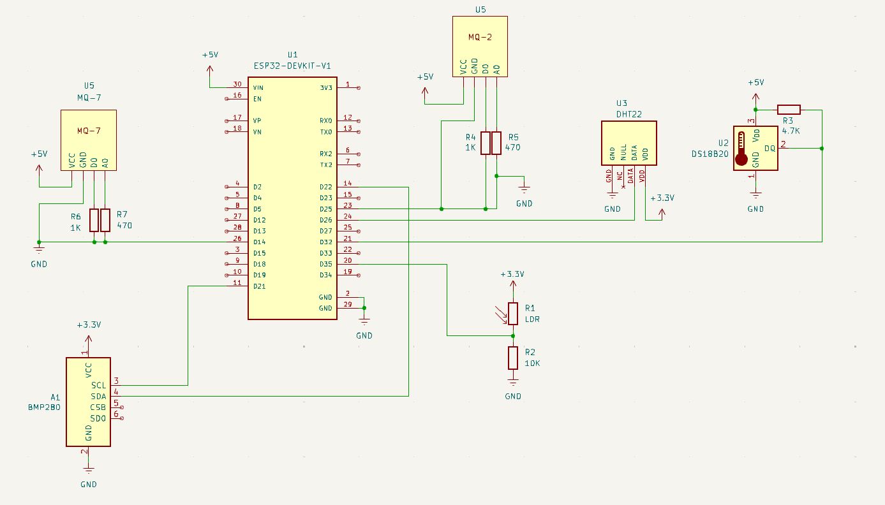

# **Documentação do Hardware**
Este documento detalha o hardware utilizado e fornece informações para aqueles que querem desenvolver dispositivos próprios para que possam ser integrados 

## **Índice**

- [**Documentação do Hardware**](#documentação-do-hardware)
  - [**Índice**](#índice)
  - [**Hardware Próprio**](#hardware-próprio)
    - [**Lista de componentes**](#lista-de-componentes)
      - [**Conexões feitas com os sensores e parâmetros:**](#conexões-feitas-com-os-sensores-e-parâmetros)
    - [**Esquemático Elétrico**](#esquemático-elétrico)
    - [**Código-Fonte**](#código-fonte)
      - [**Cadastro e Obtenção do UUID**](#cadastro-e-obtenção-do-uuid)
      - [**Modificações Necessárias no código**](#modificações-necessárias-no-código)
  - [**Para Desenvolvedores**](#para-desenvolvedores)
    - [**Estrutura de mensagens**](#estrutura-de-mensagens)
    - [**Simbolos Delimitadores Utilizados**](#simbolos-delimitadores-utilizados)
    - [**Tabela de Sensores Utilizados**](#tabela-de-sensores-utilizados)

---
## **Hardware Próprio**
Este hardware foi desenvolvido para facilitar a coleta e transmissão de dados de sensores através do protocolo MQTT. Ele consiste em um ESP32 como microcontrolador, sensores diversos e um regulador de tensão para estabilização da alimentação dos componentes.


O hardware deve permanecer ligado continuamente para garantir a transmissão de dados.


### **Lista de componentes**
|**Componentes**|**Especificação**|
| ------------------- | ----------------- |
| Microcontrolador    | ESP-32            |
| Regulador de tensão | 3.3V e 5V         |
| Resistores          | 1K Ω , 470 Ω , 10K Ω    , 4.7K Ω           |
|Temperatura|DS18B20|
|Pressão Atmosférica|BMP280|
|Gás Inflamável|MQ-2|
|Fumaça|MQ-2|
|Monóxido de Carbono|MQ-7|
|Umidade|DHT-22|
|Luminosidade|LDR|

#### **Conexões feitas com os sensores e parâmetros:** 


| Código na Comunicação | Sensores | Tensão de Operação | Tensão de entrada | I operação | Pinos Utilizados na ESP32             | Protocolo de Comunicação Serial | Parâmetro Medido |
|----------|----------|------------|-----------|------------|--------------------------------------|---------------------------------| --------------------------------|
| 1 | DS18B20  | 3.0 - 5.5V | 3.3V ou 5V | ~1.5mA    | GPIO4 | OneWire pin D04                         | Temperatura	 |
| 2 | BMP280   | 1.71 - 3.6V | 3.3V      | ~0.006mA  | GPIO21 e GPIO22 | I2C - pin D21                          | Pressão Atmosférica	 |
| 3 | MQ-2     | 5V         | 5V        | ~150mA    | GPIO5 | Analógico                       | Gás Inflamável |
| 4 | MQ-2     | 5V         | 5V        | ~150mA    | GPIO5 | Analógico                       | Fumaça	 |
| 5 | MQ-7: Monóxido de carbono (CO)     | 3 - 5V         | 5V        | ~150mA    | GPIO18 | Analógico                       | Monóxido de Carbono (CO) |
| 6 | DHT-22   | 3.3 - 5V   | 3.3V ou 5V | ~1-2.5mA  | GPIO13   | Digital pin - D13                        | Umidade |
| 7 | LDR      | Variável (depende do resistor) | 3.3V ou 5V | Depende do circuito | GPIO35 | Analógico                   | Luminosidade |


### **Esquemático Elétrico**
Aqui temos o esquemático para auxiliar a montagem de um circuito caso haja interesse de usar este modelo.


### **Código-Fonte**
O código do cliente pode ser acessado pelo repositório: [GitHub - pji20242/hardware](https://github.com/pji20242/hardware/tree/main/cliente/src)

É necessária algumas alterações para que o dispositivo possa ter uma comunicação com nossos servidores.

Dessa maneira iremos explicar alguns passos necessários em "[Cadastro e Obtenção do UUID](#cadastro-e-obtenção-do-uuid) "e " [Modificações Necessárias no Código](#modificações-necessárias-no-código)"
#### **Cadastro e Obtenção do UUID**

_**Necessário Discutir como é feita o cadastro de um aparelho externo**_

#### **Modificações Necessárias no código**

Após ser obtido o UUID e configurados os sensores que são desejadas para transmissão.
Dentro do arquivo [main.cpp](https://github.com/pji20242/hardware/blob/main/cliente/src/main.cpp) é necessária as seguintes alterações:
- Os parámetros de [SSID e PASSWORD](https://github.com/pji20242/hardware/blob/0a3bd8475b863cc0eab97bc6db77240796a9d811/cliente/src/main.cpp#L17) para que a ESP-32 se conecte na rede local
- O parámetro de [UUID](https://github.com/pji20242/hardware/blob/0a3bd8475b863cc0eab97bc6db77240796a9d811/cliente/src/main.cpp#L28) para aquele que foi feito o seu cadastro.
## **Para Desenvolvedores**
Esta seção é destinada para aqueles desenvolvedores que desejam utilizar seus próprios dispositivos e sensores.

### **Estrutura de mensagens**
As mensagens são enviadas no formato padrão MQTT, com o seguinte exemplo de comando:
```bash
mosquitto_pub -h IP_Broker_MQTT -p Porta_Broker_MQTT -t Tópico -d -m "UUID%1=<valor1>%2=<valor2>%3=<valor3>"
```


### **Simbolos Delimitadores Utilizados**
| **Simbolo** | **Uso** |
| ----------- | ------- |
| 1 - Nésimo | Código do sensores |
| % | Delimitador interno dos diferentes payload |
| = | Delimitador do Código do sensor e Informação do sensor |

### **Tabela de Sensores Utilizados** 


| Código dos sensores | Parâmetro Associado | Unidade de medida |
|----------|----------|----------|
| 1 | Temperatura | °C |
| 2 | Pressão Atmosférica | Hectopascals |
| 3 | Gás Inflamável | |
| 4 | Fumaça | |
| 5 | Monóxido de Carbono (CO) | |
| 6 | Umidade | % |
| 7 | Luminosidade | % |

